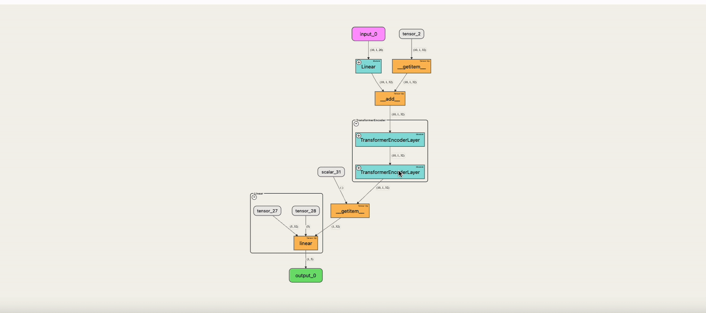
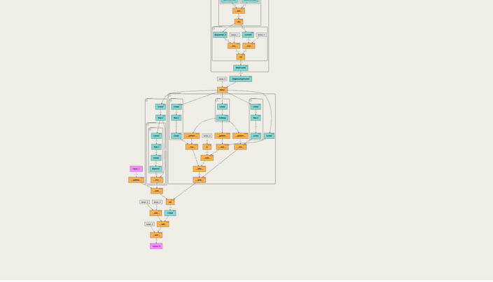
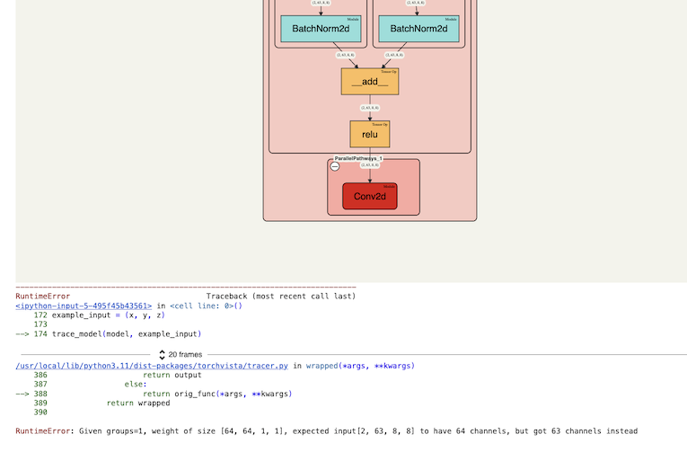
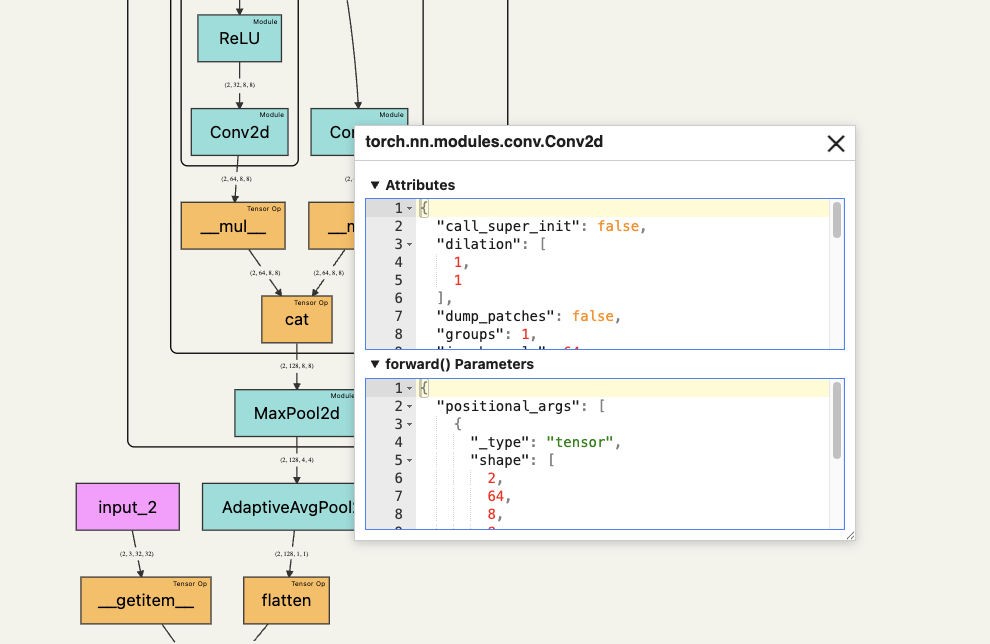

# torchvista

An interactive tool to visualize the forward pass of a PyTorch model directly in the notebook—with a single line of code. Works with web-based notebooks like Jupyter, Google Colab and Kaggle.
Note: As of now, it doesn't work properly in VSCode notebooks and this is being looked into.

## ✨ Features

#### Interactive graph with drag and zoom support



--------

#### Collapsible nodes for hierarchical modules 



--------

#### Error-tolerant partial visualization when errors arise
(e.g., shape mismatches) for ease of debugging



--------

#### Click on nodes to view parameter and attribute info



--------


## Demos

- Quick Google Colab tutorial 👉 [here](https://colab.research.google.com/drive/1wrWKhpvGiqHhE0Lb1HnFGeOcS4uBqGXw?usp=sharing#scrollTo=tUKHO2YFKi55) (must be logged in to Colab)
- Check out demos 👉 [here](https://sachinhosmani.github.io/torchvista/)

## ⚙️ Usage

Install via pip
```
pip install torchvista
```

Run from your **web-based notebook** (Jupyter, Colab, etc)

```
import torch
import torch.nn as nn

# Import torchvista
from torchvista import trace_model

# Define your module
class LinearModel(nn.Module):
    def __init__(self):
        super().__init__()
        self.linear = nn.Linear(10, 5)

    def forward(self, x):
        return self.linear(x)

# Instantiate the module and tensor input
model = LinearModel()
example_input = torch.randn(2, 10)

# Trace!
trace_model(model, example_input)
```
## API Reference: `trace_model`

    trace_model(model, inputs, max_module_expansion_depth=3, show_non_gradient_nodes=False, forced_module_tracing_depth=None, height=800)
### Parameters

#### `model` (`torch.nn.Module`)
- The model instance to trace.

#### `inputs` (`Any`)
- Input(s) to be passed to the model. Can be a single input or a tuple of inputs.

#### `height` (`int`, optional)
- Height in px of the visualization canvas.
- **Category:** Visual control
- **Default:** `800`

#### `collapse_modules_after_depth` (`int`, optional)
- Maximum depth for expanding nested modules in the initial view. `0` means everything is collapsed.
- **Category:** Visual control
- **Default:** `1`

#### `show_non_gradient_nodes` (`bool`, optional)
- Whether to show nodes for scalars, tensors, and NumPy arrays not part of the gradient graph (e.g., constants).
- **Category:** Visual control  
- **Default:** `True`

#### `forced_module_tracing_depth` (`int`, optional)
- Maximum depth to which modules' internals are traced. `None` means only user-defined modules are traced, not pre-defined library modules.
- **Category:** Tracing  
- **Default:** `None`
